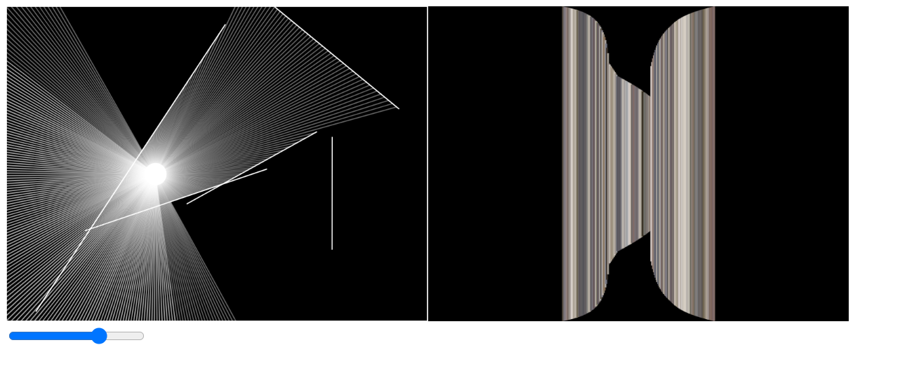

# Ray-Caster
# 2D Raycaster with p5.js

A 2D raycasting visualization built with [p5.js](https://p5js.org/). This project features both a top-down 2D view and a 3D-style first-person visualization, similar to early raycasting games like Wolfenstein 3D.

## Features

- First-person perspective rendering alongside 2D view
- Adjustable field of view (FOV) with slider control
- Player movement using arrow keys:
  - ↑ Move forward
  - ↓ Move backward
  - ← Rotate left
  - → Rotate right
- Dynamic wall rendering with distance-based shading
- Randomly generated walls within bounded play area
- Real-time intersection detection
- Smooth light and shadow effects

## Preview



## How It Works

- A particle (player) casts rays within its field of view
- Walls are randomly generated within defined boundaries
- Distance to walls determines rendering height and shading in first-person view
- Ray intersections are calculated in real-time for accurate perspective
- Square distance mapping for more realistic light falloff

## Getting Started

1. Clone the repository:  
   ```bash
   git clone https://github.com/rachmi00/Ray-Caster.git

2. Open the index.html file in any web browser of choice
