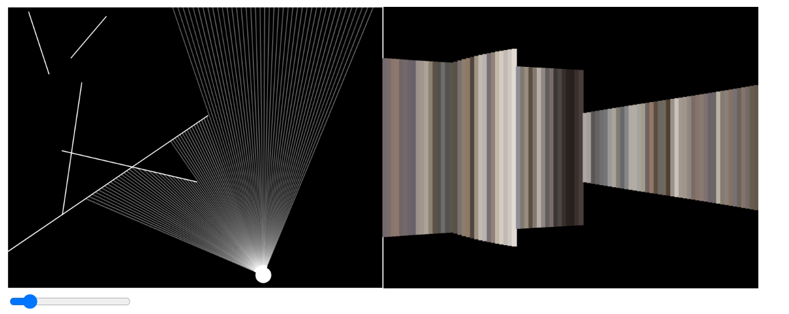

# Ray-Caster
# 2D Raycaster with p5.js

A 2D raycasting visualization built with [p5.js](https://p5js.org/). This project features both a top-down 2D view and a 3D-style first-person visualization, similar to early raycasting games like Wolfenstein 3D.

## Features

- First-person perspective rendering alongside 2D view
- Adjustable field of view (FOV) with slider control
- Player movement using arrow keys:
  - ↑ Move forward
  - ↓ Move backward
  - ← Rotate left
  - → Rotate right
- Dynamic wall rendering with distance-based shading
- Randomly generated walls within bounded play area
- Real-time intersection detection
- Smooth light and shadow effects

## Preview



## How It Works

- A particle (player) casts rays within its field of view
- Walls are randomly generated within defined boundaries
- Distance to walls determines rendering height and shading in first-person view
- Ray intersections are calculated in real-time for accurate perspective
- Square distance mapping for more realistic light falloff

Code Overview
1. sketch.js
This is the main file that sets up the canvas, initializes the walls, particle (player), and handles the drawing loop. It also manages player movement and updates the first-person view based on raycasting results.

Walls: Randomly generated walls are created within the scene boundaries.

Particle: Represents the player, casting rays and handling movement.

FOV Slider: Allows the user to adjust the field of view dynamically.

Rendering: The first-person view is rendered based on the distances calculated by the rays.

2. Ray.js
This class defines the behavior of a single ray. It handles the casting of rays and calculates intersections with walls.

Casting Rays: The cast method calculates the intersection point between a ray and a wall.

Direction: The ray's direction can be set using an angle or by looking at a specific point.

3. Particle.js
This class represents the player. It manages the rays, handles rotation, movement, and updates the first-person view.

Rays: The particle casts multiple rays within its field of view.

Movement: The player can move forward, backward, and rotate left or right.

First-person View: The look method calculates the distances to walls and renders the first-person view.

4. Points.js
This class is used to create circular points for collection (though not fully implemented in the current code).

5. Boundary.js
This class defines the walls (boundaries) in the scene. Each wall is represented by two points, and the show method draws the wall on the canvas.

## Getting Started

1. Clone the repository:  
   ```bash
   git clone https://github.com/rachmi00/Ray-Caster.git

2. Open the index.html file in any web browser of choice
